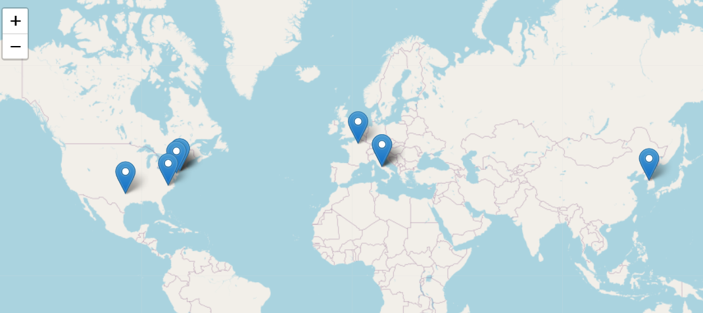

# MapConference
This is the code and data to create the map on my webiste:[poppy-zhang.com](http://poppy-zhang.com). 
It's a map of where my work has been presented. 

## Package

- library(leaflet)
- library(htmlwidgets)

## The Map Created With Rcode

